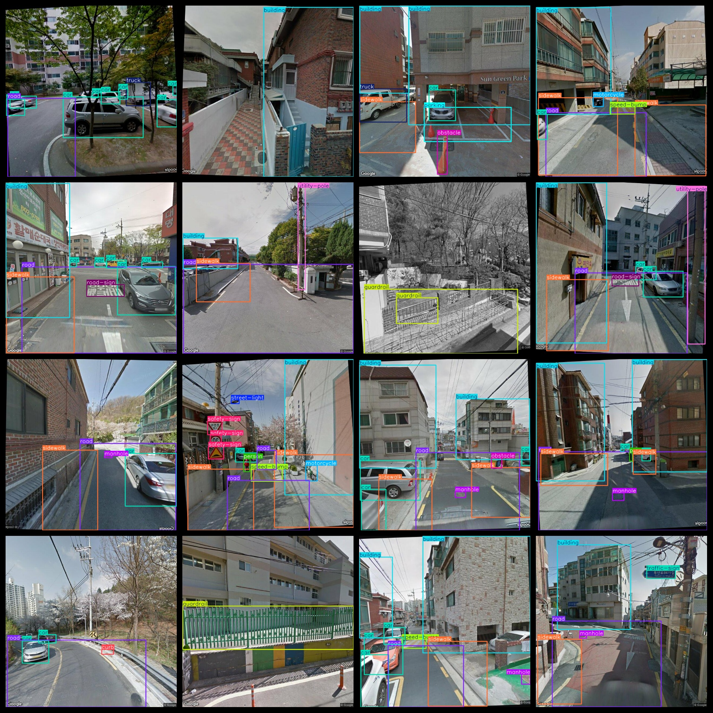
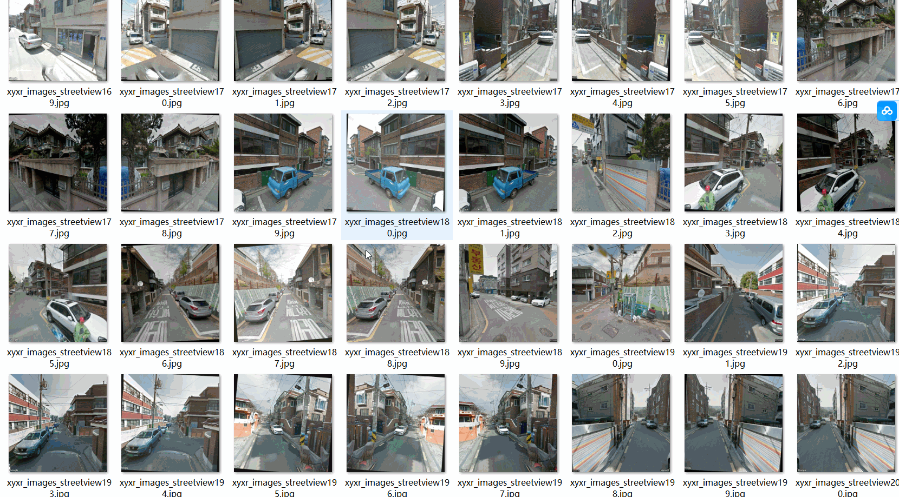

# Street View Target Detection Dataset 4813 images VOC+YOLO format

The dataset consists of a total of 4813 images in the VOC+YOLO format, including JPEG images, XML files, and TXT files. The JPEGImages folder contains a total of 4813 jpg images, the Annotations folder contains a total of 4813 xml files, and the labels folder contains a total of 4813 txt files. There are a total of 26 types of labels.

The labels include: "bicycle", "building", "bus", "car", "cctv", "crosswalk", "curb", "guardrail", "lanemarking", "manhole", "motorcycle", "obstacle", "parking", "person", "pole", "road", "road-sign", "safety-sign", "sidewalk", "speed-bump", "street-light", "terrain", "traffic light", "traffic-sign", "truck", "utility-pole".

The number of boxes (yolo category order) for each label varies:

- Bicycle: 106 boxes
- Building: 4898 boxes
- Bus: 107 boxes
- Car: 8815 boxes
- CCTV: 141 boxes
- Crosswalk: 396 boxes
- Curb: 241 boxes
- Guardrail: 612 boxes
- Lanemarking: 783 boxes
- Manhole: 886 boxes
- Motorcycle: 517 boxes
- Obstacle: 344 boxes
- Parking: 485 boxes
- Person: 1952 boxes
- Pole: 31 boxes
- Road: 4405 boxes
- Road-sign: 510 boxes
- Safety-sign: 453 boxes
- Sidewalk: 4964 boxes
- Speed-bump: 586 boxes
- Street-light: 686 boxes
- Terrain: 53 boxes
- Traffic light: 317 boxes
- Traffic-sign: 40 boxes
- Truck: 784 boxes
- Utility-pole: 1287 boxes

Total box count: 34399 boxes

The image resolution is clear.

Image enhancement is enabled.

Labels are in the shape of rectangular boxes, used for target detection recognition.

Important notes: No further statements are provided regarding accuracy or precision guarantees for models trained on this dataset. The dataset only provides accurate and reasonable annotations.

Annotation and image details are as follows:

## Images

---

Here is a pay link on Stripe (https://buy.stripe.com/3cs8yP7sY87d0vu9AB). Please contact me lonlonago@foxmail.com after funding $89, and I will send you a complete data files, thank you!

